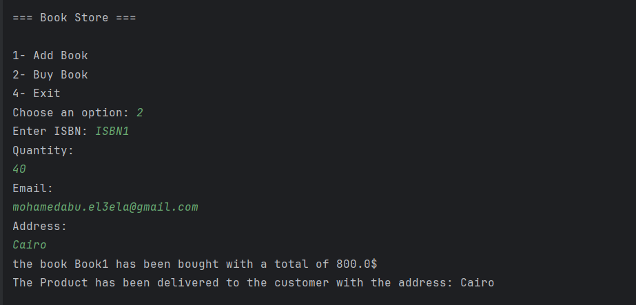
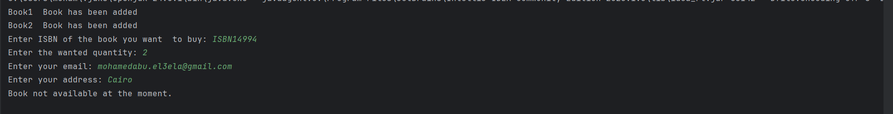
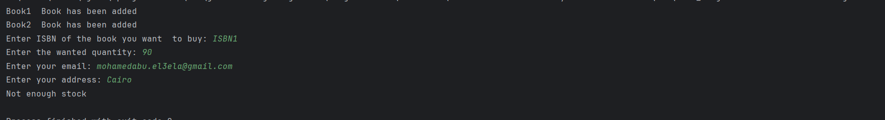
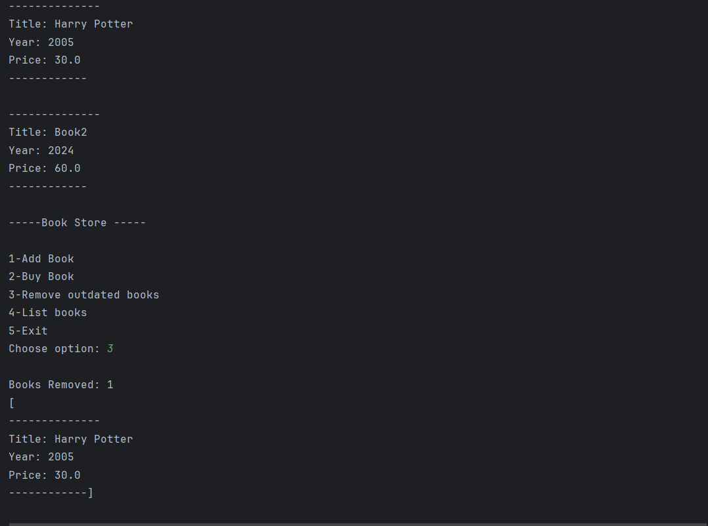

# Book Store

##  Features

-  Add books to the inventory (`PAPER`, `EBOOK`, `DEMO`)
-  Buy books 
-  Remove outdated books 
-  Error handling for invalid inputs 
-  Simulated delivery for PaperBooks(Shipping) and EBooks(Mail)

---
## Design Patterns Used

- **Factory Pattern**: Used to create different book types (`BookFactory`)
- **Dependency Injection**: `BookShop` gets its services through constructor injection
- **Strategy Pattern**: Mail and Shipping services implement the same delivery interface


---

## Solid Principles

- All books inherit from one simple **BaseBook** model (Paperbook , Ebook , DemoBook)
- Each class is responsible of something
- You can always add new book types without fully changing the layout
- Each service implement only what is necessary
- Dependency Injection on Classes like **BookShop** where it depends on abstractions , not concerete types.

---------

## Examples from running app

###  Buying a Paper Book



---

## Invalid ISBN 



---

## Out Of Stock



## Removing Outdated Books



---

## How to Test

Use the`TestingBookShop` class to:

-  Add books to inventory
-  Remove books from inventory
-  Buy a book 

Or you can just  run the `UserProgram.userInterface()` for an interactive experience with UI:

```java
UserProgram.userInterface();
```

## Prerequisites
- JDK 17+
- Maven 3.8+ / Gradle 7.4+

### Installation
```bash
git clone https://github.com/Eldax23/fawryTask2.git
cd fawryTask2
mvn clean install
